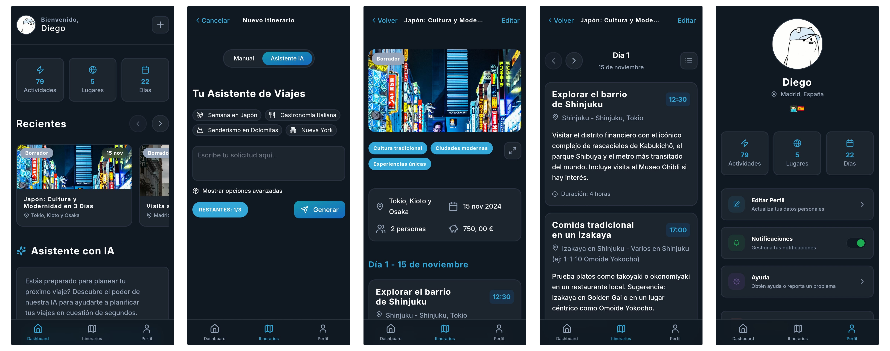

  

---

> **🧭 Overview**
> 
> **TripFlow** is an innovative Progressive Web App (PWA) designed for comprehensive travel itinerary management and intelligent route optimization. Built with modern web technologies, it empowers travellers to create, customize, and optimize their journeys with the help of artificial intelligence and advanced algorithms.
> 
> This **Final Degree Project (TFG)** develops a travel planning application using Spring Boot and React, with AI-powered itinerary generation and route optimization algorithms. The project demonstrates the integration of modern web technologies to solve real-world travel planning challenges.
> 
> This project is developed as part of the Final Degree Project (TFG) for the **Bachelor’s Degree in Software Engineering** at **ETSII - Universidad Rey Juan Carlos**.

---

---

## 📚 Documentation

1. [Objectives](docs/01-objectives.md)
2. [Methodology](docs/02-methodology.md)
3. [Features](docs/03-features.md)
4. [Analysis](docs/04-analysis.md)
5. [Tracking](docs/05-tracking.md)
6. [Authors](docs/06-authors.md)
7. [Development Guide](docs/07-dev-guide.md)
8. [Roadmap](docs/08-roadmap.md)
9. [Releases](#-releases)
10. [License](#-license)

---

## 📦 Releases

- [v0.1.0 Release Notes](docs/releases/v0.1.0.md)

---

## 📄 License

> Licensed under the Apache License, Version 2.0 (the "License");
> you may not use this file except in compliance with the License.
> You may obtain a copy of the License at
> 
>     http://www.apache.org/licenses/LICENSE-2.0
> 
> Unless required by applicable law or agreed to in writing, software
> distributed under the License is distributed on an "AS IS" BASIS,
> WITHOUT WARRANTIES OR CONDITIONS OF ANY KIND, either express or implied.
> See the License for the specific language governing permissions and
> limitations under the License.

---